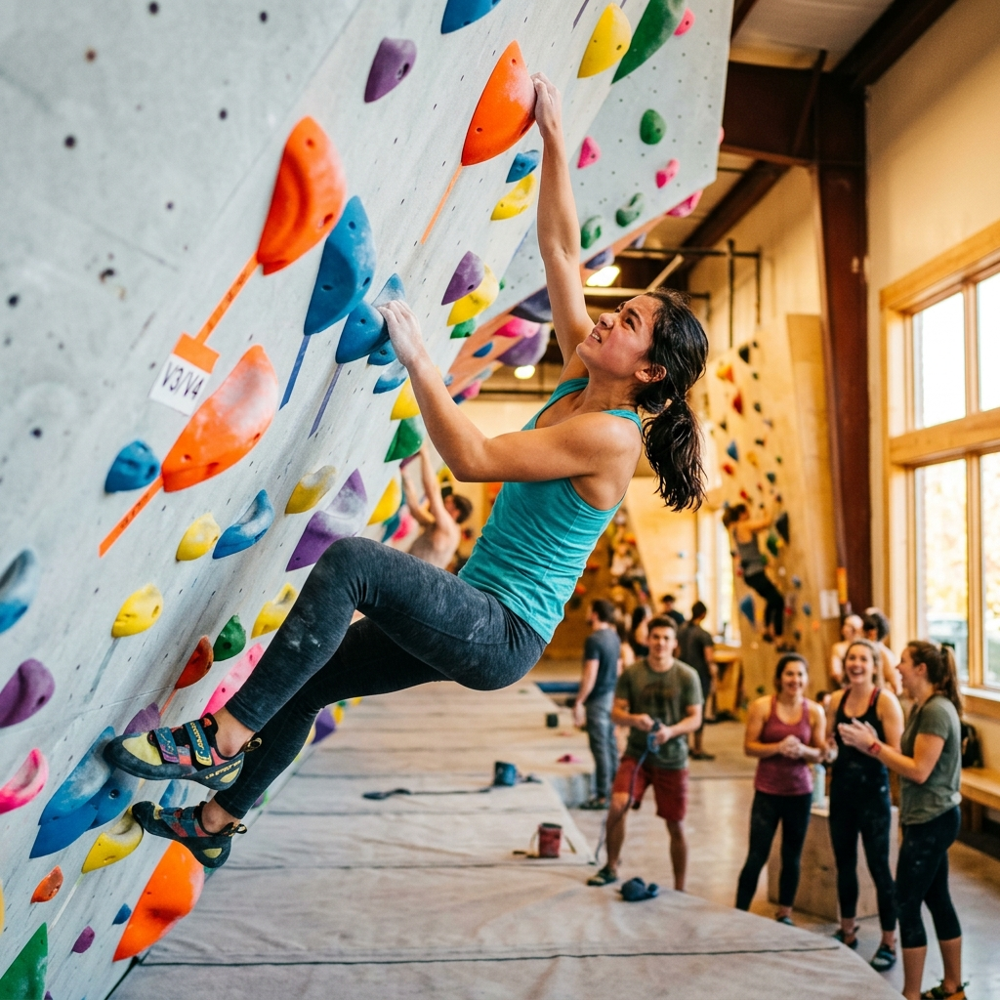

# Access to Climbing

  

  <strong>Breaking barriers. Building futures.</strong> 
  Free, beginner-friendly bouldering sessions for youth aged 13–17 in Waterloo Region.

  <a href="https://www.instagram.com/access2climbing/">Instagram</a> ·
  <a href="https://gofund.me/8d9cdc7f2">Donate</a> ·
  <a href="mailto:access2climbing@gmail.com">Contact</a>

## What is Access to Climbing?

Access to Climbing is a student-led, adult-supervised community initiative that gives young people an accessible first experience with bouldering.

We organize free, one-time sessions for youth aged **13–17** in Waterloo Region who face financial, social, or cultural barriers to sport. No climbing experience or equipment is required: admission, climbing shoes, chalk, and supervision are covered through community grants, donations, sponsors, and partners.

Sessions are hosted at [Grand River Rocks — Waterloo](https://grandriverrocks.com/waterloo/).

This repository contains the initiative's public website. The site explains the program, publishes session information, answers common questions, recognizes community partners, and directs participants to registration and waiver forms.

## Our mission

Our mission is to make climbing a doorway to **belonging, confidence, and community**.

Many young people are excluded from organized sport by cost, unfamiliarity, culture, or the pressure of traditional team environments. Bouldering offers a different path: progress is personal, challenges can be approached at an individual's own pace, and the climbing community creates natural opportunities for encouragement and connection.

Access to Climbing is especially intended to reach:

- newcomer and refugee youth;
- youth from low-income households;
- racialized youth who are underrepresented in climbing spaces; and
- young people who have not found a sense of belonging in traditional sports.

The goal is not only to provide a day at a climbing gym. It is to help participants discover what they are capable of and feel welcome in a supportive community.

## How the program works

1. **Sign up** — A participant submits the registration form linked from the website. Capacity is limited and places are confirmed on a first-come, first-served basis.
2. **Get confirmed** — The team follows up by email or SMS and provides the required waiver information. Participants under 18 need a parent or guardian to complete the applicable waivers.
3. **Show up and climb** — The participant attends the scheduled session at Grand River Rocks — Waterloo. Comfortable clothing is all they need to bring; shoes and chalk are provided.

To make the opportunity available to as many young people as possible, the program currently offers one session per participant and prioritizes first-time climbers.

> Registration, waivers, donations, and social updates are handled by trusted external services linked from the website. This repository does not collect or store participant information.

## How the initiative is made possible

Access to Climbing is community-funded and organized collaboratively:

- **Student leaders** coordinate fundraising, logistics, communications, and the participant experience.
- **Adult supervision** supports safe and responsible delivery.
- **Grand River Rocks — Waterloo** provides the facility and professional climbing environment.
- **Community organizations and schools** help connect the initiative with eligible youth.
- **Donors, sponsors, and grants** cover admission, rental equipment, chalk, and supervision costs.

Organizations interested in referrals, outreach, in-kind support, or session sponsorship can contact [outreach.access2climbing@gmail.com](mailto:outreach.access2climbing@gmail.com).

## Support the mission

There are several ways to help:

- [Donate through GoFundMe](https://gofund.me/8d9cdc7f2)
- Sponsor a complete climbing session
- Provide equipment, transportation, promotion, or other in-kind support
- Refer eligible youth through a school or community organization
- Share [@access2climbing](https://www.instagram.com/access2climbing/) with the Waterloo Region community

For sponsorships and general inquiries, email [access2climbing@gmail.com](mailto:access2climbing@gmail.com).

